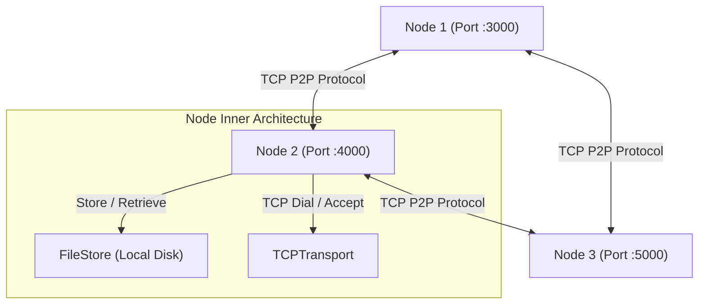

# Distributed P2P File Storage System

A decentralized, distributed peer-to-peer (P2P) file storage system implemented in Go. This system allows nodes to join a network, bootstrap connections with existing peers, and store/retrieve files using Content Addressable Storage (CAS).

## Table of Contents
- [Architecture Overview](#architecture-overview)
- [Key Features](#key-features)
- [Key Code Components](#key-code-components)
- [How It Works](#how-it-works)
  - [Content Addressable Storage (CAS)](#content-addressable-storage-cas)
  - [File Replication (Store)](#file-replication-store)
  - [File Retrieval (Get)](#file-retrieval-get)
- [Getting Started](#getting-started)
  - [Prerequisites](#prerequisites)
  - [Running the Code](#running-the-code)

## Architecture Overview



The system consists of independent nodes connecting over TCP. Each node acts as a file server that can both store files locally and replicate/broadcast them to its peers.

## Key Features

- **P2P Networking**: TCP-based peer-to-peer transport protocol with customizable decoders and handshake handlers.
- **Content Addressable Storage (CAS)**: Files are stored based on the SHA-1 hash of their content key. This ensures data integrity and deduplication.
- **Auto-Bootstrapping**: New nodes can register bootstrap peer addresses to join the network topology.
- **File Replication**: Storing a file on one node broadcasts it to all bootstrap peers in the network.
- **Fallback Retrieval**: If a requested file is missing locally, the node automatically broadcasts a retrieval request to its network peers.

## Key Code Components

- [main.go](file:///home/alok/alokxcode/distributed_file_storage_system/main.go): Boots multiple node servers locally (e.g., ports `:3000` and `:4000`) and tests store/get operations.
- [server.go](file:///home/alok/alokxcode/distributed_file_storage_system/server.go): Implements [NodeServer](file:///home/alok/alokxcode/distributed_file_storage_system/server.go#L21) which manages the network lifecycle, local storage integration, message consumption, broadcasting, and peer tracking.
- [store.go](file:///home/alok/alokxcode/distributed_file_storage_system/store.go): Implements [FileStore](file:///home/alok/alokxcode/distributed_file_storage_system/store.go#L67), which handles path transformation (via [CASPathTransformFunc](file:///home/alok/alokxcode/distributed_file_storage_system/store.go#L37)) and local disk reads/writes.
- [p2p/tcp_transport.go](file:///home/alok/alokxcode/distributed_file_storage_system/p2p/tcp_transport.go): Contains the TCP transport logic, handling incoming connection accepts and dialing external nodes.

## How It Works

### Content Addressable Storage (CAS)
When a file is saved using a key (e.g. `test.jpeg`), its path is transformed by taking its SHA-1 hash:
1. The SHA-1 hash is hex-encoded.
2. The hash string is split into chunks of 8 characters to form a nested directory path.
3. The file is saved at `<storage-root>/<nested-hash-dirs>/<hash>`.

### File Replication (Store)
Calling `Store` on a node:
1. Writes the file to the local [FileStore](file:///home/alok/alokxcode/distributed_file_storage_system/store.go#L67).
2. Bootstraps connections to peers.
3. Broadcasts the message over TCP using [Broadcast](file:///home/alok/alokxcode/distributed_file_storage_system/server.go#L133):
   - First, sends a command header and a Gob-encoded [File_MetaData](file:///home/alok/alokxcode/distributed_file_storage_system/p2p/message.go) struct.
   - Second, streams the raw payload using `io.MultiWriter` directly into peer connections.

### File Retrieval (Get)
Calling `Get` on a node:
1. Looks up the file locally via [FileStore.Has](file:///home/alok/alokxcode/distributed_file_storage_system/store.go#L151).
2. If the file is missing locally, it connects to bootstrap nodes and invokes `Fetch`, sending a `GET` request to its peers to stream the file back.

## Getting Started

### Prerequisites
- Go version 1.22.2 or higher.

### Running the Code

1. Build or run the main entry point:
   ```bash
   go run main.go server.go store.go
   ```
2. Run the tests:
   ```bash
   go test ./...
   ```
